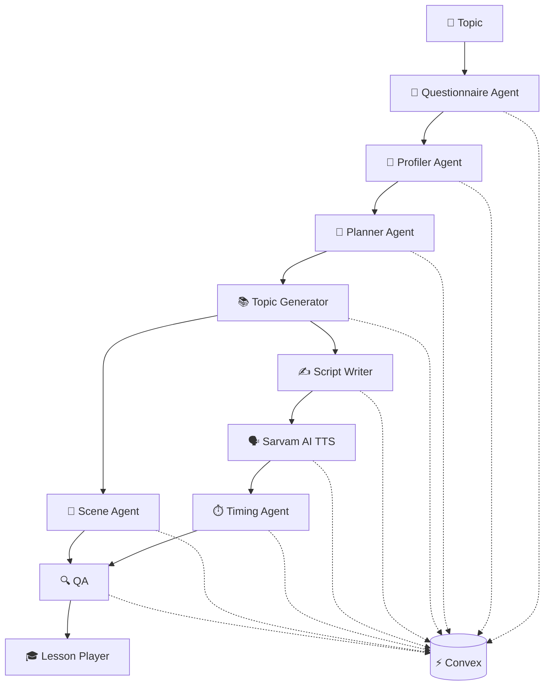

<div align="center">

# 🎓 CurriculumOS

### AI-Powered Personalized Learning Platform

**Learn in your language. At your level. At your pace.**

<br>


<br>

[](https://curriculum-os-rho.vercel.app/)
[](https://github.com/jainyash1404/curriculum-os)

</div>

---

## 🎓 About CurriculumOS

**CurriculumOS** is an AI-powered personalized learning platform that creates technical courses based on the learner's **knowledge level, strengths, gaps, and preferred language**.

Instead of simply translating courses, CurriculumOS generates lessons specifically for the learner.

> 🧠 Diagnostic-driven personalization
> 🗣️ 11 Indian languages
> 🤖 Multi-agent AI pipeline
> ⚡ Real-time course generation
> 🎧 AI-powered native narration

---

## ✨ Why CurriculumOS?

Traditional AI course generators:

```text
Topic → Generic Course → Learner
```

CurriculumOS works differently:

```text
Topic
  ↓
Diagnostic Assessment
  ↓
Learner Profile
  ↓
Personalized Curriculum
  ↓
AI Lesson + Native Narration
  ↓
Interactive Learning
```

Two learners studying the same topic can therefore receive completely different lessons.

---

## 🏗️ Architecture



---

## 🚀 Features

- 🎯 Diagnostic-Based Personalization
- 🤖 Multi-Agent AI Course Generation
- 🗣️ 11 Indian Language Support
- 🔊 Sarvam AI Native TTS
- 🌍 Mid-Playback Language Switching
- 🎨 Interactive HTML Learning Scenes
- ⏱️ Audio & Scene Synchronization
- ⚡ Real-Time Convex Pipeline
- 🔐 Secure Authentication
- 📊 Personalized Learner Profiles

---

## 🛠️ Tech Stack

| Layer | Technology |
|---|---|
| Frontend | React, TanStack Start, TypeScript |
| Styling | Tailwind CSS |
| AI | Google Gemini |
| TTS | Sarvam AI `bulbul:v3` |
| Backend / DB | Convex |
| Validation | Zod |
| Auth | Node scrypt + Signed Sessions |
| Deployment | Vercel + Convex |

---

## 🌍 Language Support

CurriculumOS supports **11 languages**, including:

Hindi · Bengali · Gujarati · Kannada · Malayalam · Marathi · Odia · Punjabi · Tamil · Telugu · English

---

## ⚡ Getting Started

```bash
git clone https://github.com/jainyash1404/curriculum-os.git
cd curriculum-os
npm install
```

Create `.env.local`:

```env
GOOGLE_GENERATIVE_AI_API_KEY=your_key
SARVAM_API_KEY=your_key
AUTH_SESSION_SECRET=your_secret
VITE_CONVEX_URL=your_convex_url
CONVEX_DEPLOYMENT=your_deployment
```

Run the project:

```bash
npx convex dev
npm run dev
```

Open:

```text
http://localhost:3000
```

---

## 🔐 Security

- Secure password hashing with scrypt
- Signed session cookies
- Server-side validation
- Environment-based secrets
- API keys excluded from source control

---

## 🗺️ Roadmap

- [x] AI Course Generation
- [x] Diagnostic Assessment
- [x] Learner Profiling
- [x] Multi-Agent Pipeline
- [x] 11-Language Narration
- [x] Interactive Lessons
- [x] Real-Time Pipeline
- [ ] Production Deployment
- [ ] Advanced Learner Analytics
- [ ] Mastery Tracking

---

## 👨‍💻 Author

<div align="center">

**Yash Jain**

Built with ❤️ using TanStack Start, Convex, Gemini & Sarvam AI

</div>
